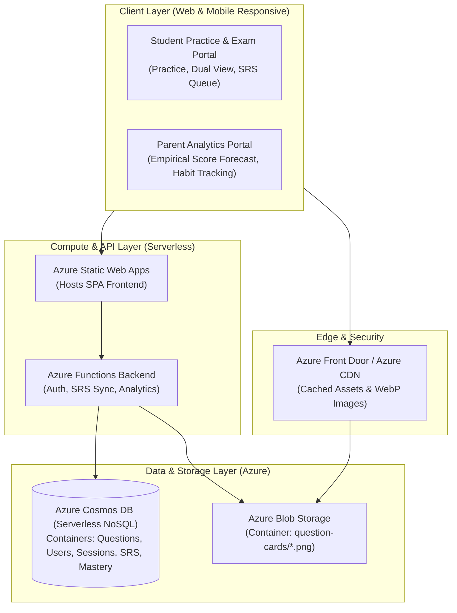
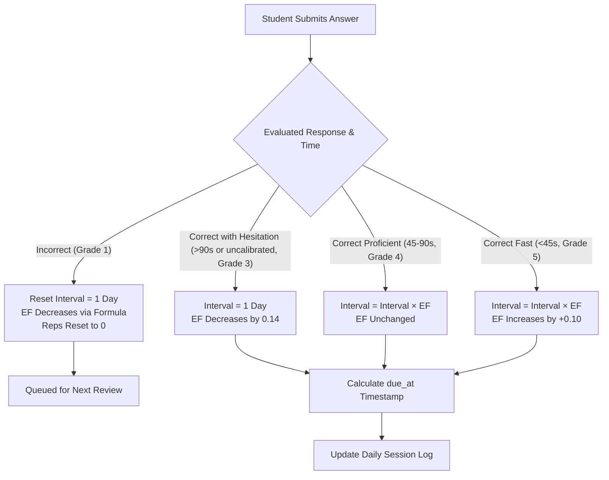
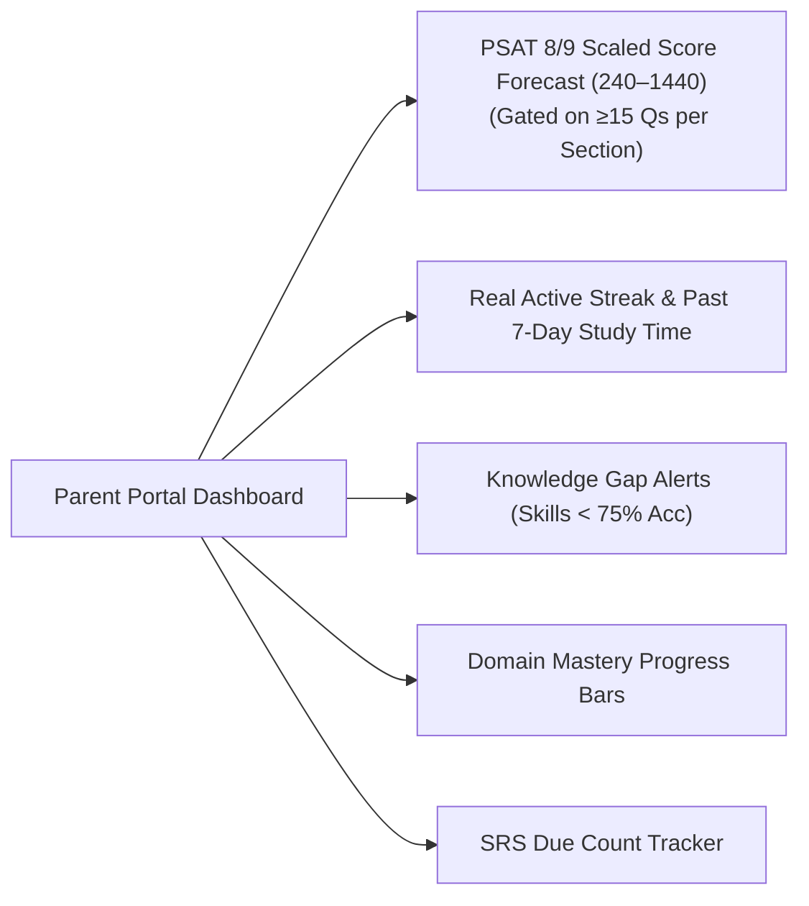
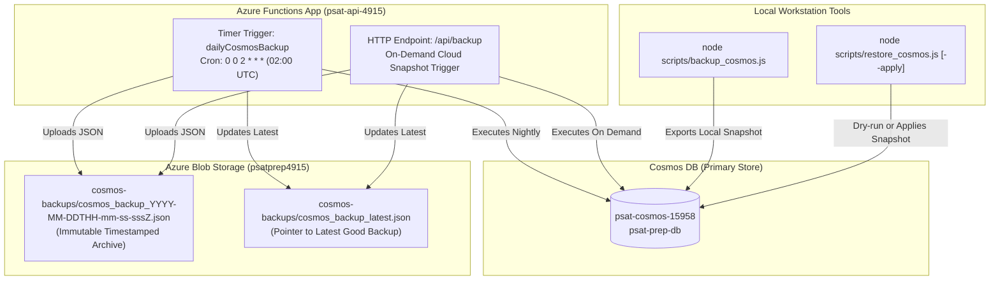

# PSAT Prep Mastery & Analytics Platform
## System Architecture, Spaced Repetition Engine, Azure Deployment, and Developer Guide

---

## 1. Executive Summary & Dataset Metrics

The College Board PSAT Question Banks for **Reading and Writing (ELA)** and **Math** have been fully extracted and validated with **100% schema integrity** across all **3,059 questions**.

### 1.1 Dataset Statistics

| Subject | Total Questions | Schema Valid | Text-Complete | Easy | Medium | Hard | MCQ | Free Response (SPR) |
| :--- | :---: | :---: | :---: | :---: | :---: | :---: | :---: | :---: |
| **Reading & Writing (ELA)** | **1,554** | **1,554 (100%)** | **1,553 (99.9%)** | 90 | 499 | 965 | 1,554 | 0 |
| **Math** | **1,505** | **1,505 (100%)** | **605 (40.2%)** | 186 | 438 | 881 | 1,140 | 365 |
| **Total Combined** | **3,059** | **3,059 (100%)** | **2,158 (70.5%)** | **276** | **937** | **1,846** | **2,694** | **365** |

> [!NOTE]
> In College Board Math PDFs, complex formulas, coordinate grids, and geometry diagrams are rendered as vector curves rather than text. By design, the rendered PNG question cards in `data/images/` serve as the 100% complete, un-spoiled visual authority for all 3,059 questions.

### 1.2 Domain Distribution
- **Reading & Writing**:
  - *Information and Ideas*: 452 questions
  - *Craft and Structure*: 387 questions
  - *Standard English Conventions*: 372 questions
  - *Expression of Ideas*: 343 questions
- **Math**:
  - *Algebra*: 577 questions
  - *Advanced Math*: 375 questions
  - *Problem-Solving and Data Analysis*: 361 questions
  - *Geometry and Trigonometry*: 192 questions

---

## 2. Azure Cloud & Database Architecture



### 2.1 Storage Decision: Azure Cosmos DB vs. Relational

**Recommendation: Azure Cosmos DB (Core NoSQL API - Serverless Tier)**
- **Polymorphic Schema**: Questions have variable structures (MCQs with 4 choices vs. numeric Free Response strings; reading passages vs. geometry diagrams).
- **Sub-10ms Global Latency**: Fast partition-keyed retrieval partitioned by `/domain` or `/user_id`.
- **Cost-Optimized Serverless**: Zero idle cost; charges strictly per Request Unit (RU) consumed during practice.

---

### 2.2 Cosmos DB Container Specifications & Schemas

#### Container 1: `Questions`
- **Partition Key**: `/domain`

```json
{
  "id": "737870c6",
  "assessment": "PSAT 8/9",
  "test": "Reading and Writing",
  "domain": "Information and Ideas",
  "skill": "Inferences",
  "difficulty": "Hard",
  "type": "multiple_choice",
  "question_text": "Geoglyphs are large-scale designs of lines or shapes created in a natural landscape...",
  "options": [
    { "key": "A", "text": "must represent a species of whale..." },
    { "key": "B", "text": "is actually located in Germany..." },
    { "key": "C", "text": "is probably in a location Isla hadn’t ever come..." },
    { "key": "D", "text": "was almost certainly created a long time after..." }
  ],
  "correct_answer": "C",
  "rationale": "Choice C is the best answer because it most logically completes...",
  "image_url": "https://<account>.blob.core.windows.net/question-cards/737870c6_question.png",
  "has_image": true,
  "text_complete": true,
  "rationale_letter_mismatch": false
}
```

#### Container 2: `SpacedRepetitionCards`
- **Partition Key**: `/user_id`

```json
{
  "id": "srs_student123_737870c6",
  "user_id": "student123",
  "question_id": "737870c6",
  "test": "Reading and Writing",
  "domain": "Information and Ideas",
  "skill": "Inferences",
  "repetitions": 3,
  "interval_days": 7,
  "ease_factor": 2.7,
  "last_reviewed_at": 1787500000000,
  "due_at": 1788104800000,
  "history": [
    { "at": 1787500000000, "grade": 5, "timeSpentMs": 32000, "isCorrect": true }
  ]
}
```

---

## 3. Spaced Repetition (SRS) Engine (SuperMemo SM-2)

The spaced repetition engine in `srs.js` prevents knowledge decay by scheduling reviews based on response accuracy and foreground response time:



### 3.1 Mathematical Formulation
1. **Grade Calculation ($q \in [1..5]$)**:
   - If incorrect: $q = 1$.
   - If correct and time $< 45\text{s}$: $q = 5$.
   - If correct and time $45\text{s} - 90\text{s}$: $q = 4$.
   - If correct and time $> 90\text{s}$ (or uncalibrated): $q = 3$.

2. **Ease Factor Update ($EF$)**:
   $$EF' = \max\left(1.3, \, EF + (0.1 - (5 - q) \times (0.08 + (5 - q) \times 0.02))\right)$$
   *(Note: At $q=1$, this formula decreases $EF$ by $0.54$; at $q=4$, $EF$ remains unchanged; at $q=5$, $EF$ increases by $+0.10$.)*

3. **Interval Progression ($I$)**:
   - If $q < 3$: $R = 0, I = 1\text{ day}$.
   - If $q \ge 3$:
     - $R = 0 \rightarrow I = 1\text{ day}$
     - $R = 1 \rightarrow I = 3\text{ days}$
     - $R = 2 \rightarrow I = 7\text{ days}$
     - $R \ge 3 \rightarrow I_{new} = \text{round}(I_{old} \times EF')$
     - $R = R + 1$

---

## 4. Empirical Parent Oversight & Score Forecast

The Parent Portal (`parent.html`) provides real empirical measurements on the official **PSAT 8/9 Scale (240–1440)**:



### 4.1 Scoring Rules
- **Reading & Writing**: Scaled from 120 to 720 ($120 + \text{accuracy} \times 600$).
- **Math**: Scaled from 120 to 720 ($120 + \text{accuracy} \times 600$).
- **Total Composite**: Sum of RW and Math scores ($240 - 1440$).
- **Gate**: Displays `—` until at least 15 questions have been attempted in each section to prevent misleading low-sample projections.

---

## 5. Repository Structure

```
psat-prep/
├── .github/
│   └── workflows/
│       └── test-and-validate.yml    # CI test and dataset validation workflow
├── data/
│   ├── ela_questions.json           # 1,554 ELA questions (99.9% text-complete)
│   ├── math_questions.json          # 1,505 Math questions (40.2% text-complete, 100% visual card)
│   ├── questions_data.js            # Combined JS bundle (3,059 questions)
│   └── images/                      # 3,059 rendered question card PNGs
├── tests/
│   ├── fixtures/                    # Text fixtures for portable Python parser tests
│   ├── test_free_response.js        # Free-response numerical evaluation tests
│   ├── test_srs.js                  # Spaced repetition SM-2 unit tests
│   └── test_dataset_free_response.js# Dataset-wide 365 free-response verification
├── index.html                       # Student Practice & Analytics Portal
├── parent.html                      # Parent Oversight & Score Forecaster
├── srs.js                           # Core SM-2 & Free-Response Grading Engine
├── extractor.py                     # Multi-core PDF parser & image renderer
├── validator.py                     # Schema and text-completeness validator
├── rebuild_bundle.py                # Zero-PDF bundle generator
├── test_extractor.py                # Portable Python unit & integration test suite
├── upload_to_azure.py               # Azure Cosmos DB & Blob Storage uploader
├── SYSTEM_ARCHITECTURE_AND_PLAN.md  # Comprehensive technical specification
├── AGENT_HANDOFF.md                 # LLM Agent briefing document
├── README.md                        # Quickstart documentation
└── requirements.txt                 # Python dependencies
```

---

## 6. Azure Deployment Step-by-Step Guide

### Step 1: Create Azure Resources
```bash
az group create --name rg-psat-prep --location eastus

# Create Cosmos DB Account (Serverless)
az cosmosdb create \
  --name psat-prep-cosmos \
  --resource-group rg-psat-prep \
  --capabilities EnableServerless

# Create Blob Storage Account
az storage account create \
  --name psatprepstorage \
  --resource-group rg-psat-prep \
  --sku Standard_LRS
```

### Step 2: Upload Data & Assets
```bash
export COSMOS_CONNECTION_STRING="<YOUR_COSMOS_CONNECTION_STRING>"
export BLOB_CONNECTION_STRING="<YOUR_BLOB_CONNECTION_STRING>"
export BLOB_BASE_URL="https://psatprepstorage.blob.core.windows.net"

python3 upload_to_azure.py
```

### Step 3: Deploy Frontend to Azure Static Web Apps / Blob Storage ($web)
```bash
# Upload static assets to $web container
ACCOUNT_KEY=$(az storage account keys list --resource-group rg-psat-prep --account-name psatprep4915 --query '[0].value' -o tsv)

for file in index.html parent.html mistakes.html srs.js; do
  az storage blob upload --account-name psatprep4915 --account-key "$ACCOUNT_KEY" --container-name '$web' --name "$file" --file "$file" --overwrite true
done
```

---

## 7. Automated Cloud Backup Architecture & Disaster Recovery

Progress records in Azure Cosmos DB (`UATStudentAnswers`, `UATFeedback`) are safeguarded against accidental corruption or data loss via a three-tier backup system:



### 7.1 Safety Invariants
1. **Zero-Document Guard**: The backup runner refuses to overwrite existing archives if Cosmos DB returns 0 documents.
2. **Dry-Run Protected Restore**: `node scripts/restore_cosmos.js` defaults to a safe dry-run listing target documents. Writes require explicit `--apply`.
3. **Off-Machine Separation**: Nightly snapshots are stored in Azure Blob Storage container `cosmos-backups` completely independent of local developer machines.

---

## 8. Dual-Version Deployment Architecture (Unified Data)

To allow experimental features, Claude deep-dive explainers, and UI enhancements without disrupting daily student testing, the platform operates in a **Dual-Frontend, Single-Data Model**:

- **Production (Stable v1.0)**: `https://psatprep4915.z13.web.core.windows.net/`
  - Purpose: Daily timed exams, routine practice, official score reports.
- **Beta / Staging**: `https://psatprep4915.z13.web.core.windows.net/beta/`
  - Purpose: Rapid testing of new explainer formats, UI improvements, and experimental drills.
- **Shared Data Invariant**: Both environments connect to the same Azure API (`/api/syncStudentAnswers`) and read/write the same Cosmos DB document (`student_default_student`). Practice completed in either version seamlessly merges.

---

## 9. 7-Week High-Yield Sprint Mode (Mid-October Target)

When time is limited before the official test, the engine dynamically reweights question pools:
- **Difficulty Weighting**: High-Yield mode draws Hard and Medium questions first to qualify for and excel in the Module 2 Upper Difficulty Track (the 600–720 score band).
- **Domain Weighting**: Prioritizes high-weight College Board domains (*Algebra*, *Advanced Math*, *Information and Ideas*, *Craft and Structure*).
- **Activation**: Enabled via toggle in Parent Portal / Student Lobby or via URL parameter `&highyield=true`.

