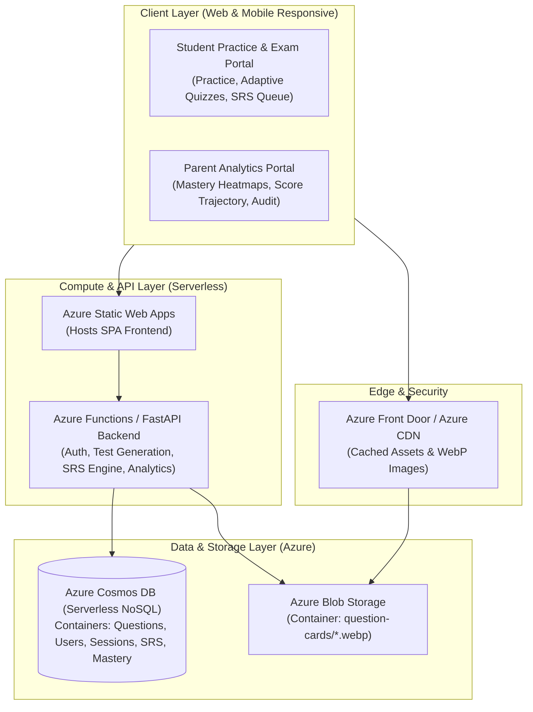
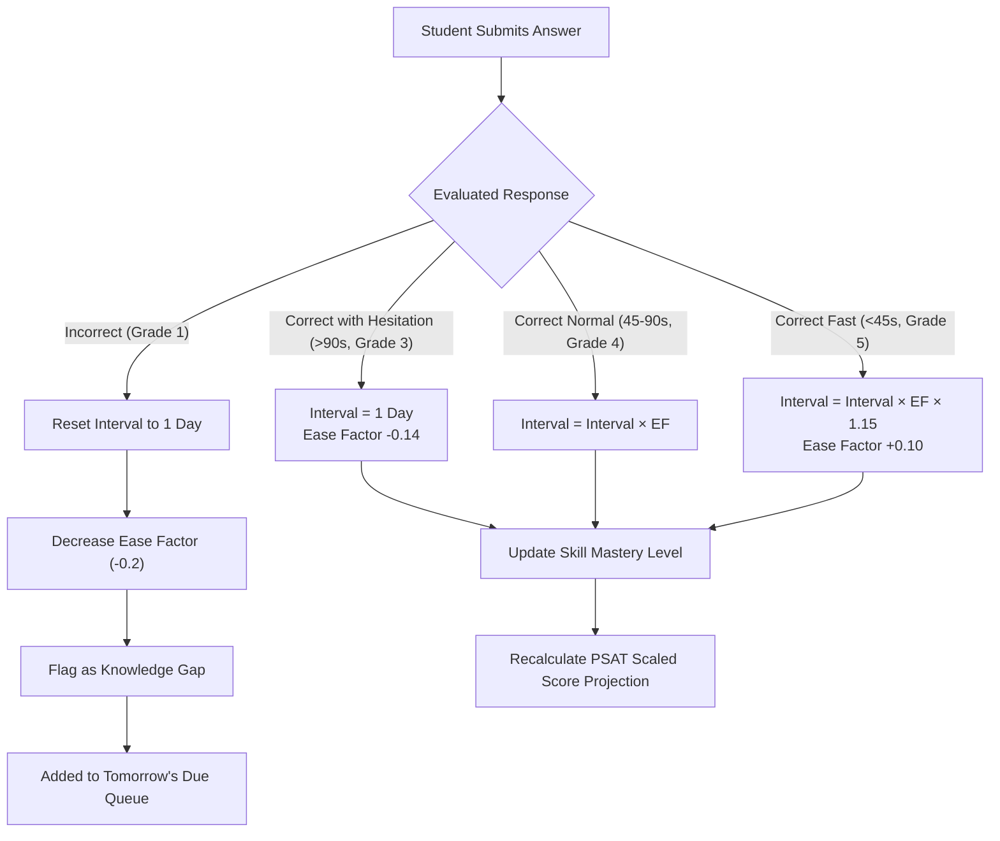
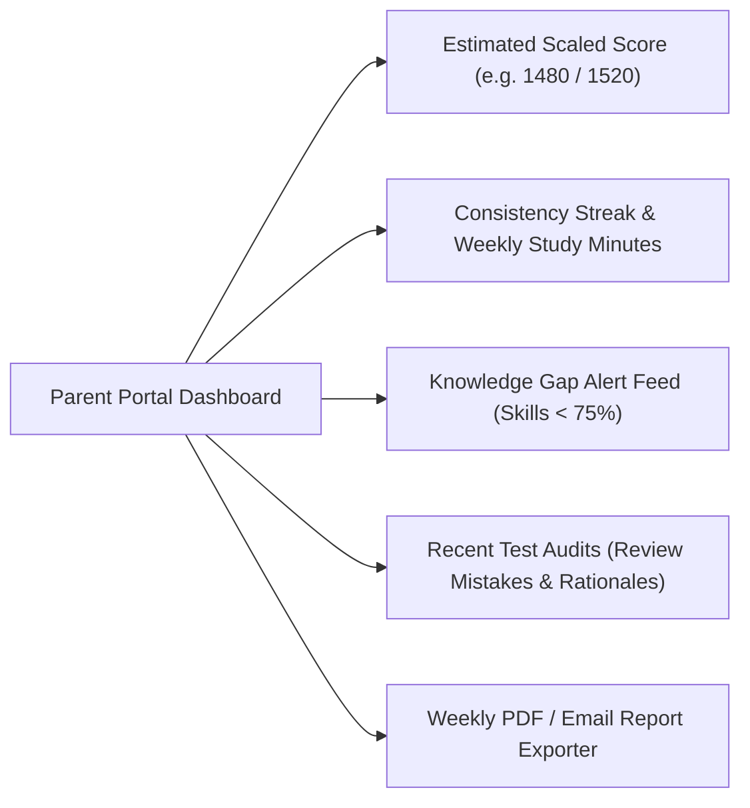

# PSAT Prep Mastery & Analytics Platform
## System Architecture, Spaced Repetition Engine, Azure Deployment, and Developer Guide

---

## 1. Executive Summary & Extraction Results

The College Board PSAT Question Banks for **Reading and Writing (ELA)** and **Math** have been fully extracted, structured, and validated with **100% integrity** across all **3,059 questions**.

### 1.1 Dataset Statistics

| Subject | Total Questions | Validated | Easy | Medium | Hard | MCQ | Free Response (SPR) |
| :--- | :---: | :---: | :---: | :---: | :---: | :---: | :---: |
| **Reading & Writing (ELA)** | **1,554** | **1,554 (100%)** | 90 | 499 | 965 | 1,554 | 0 |
| **Math** | **1,505** | **1,505 (100%)** | 186 | 438 | 881 | 1,140 | 365 |
| **Total Combined** | **3,059** | **3,059 (100%)** | **276** | **937** | **1,846** | **2,694** | **365** |

### 1.2 Domain Distribution
- **Reading & Writing**:
  - *Information and Ideas*: 452 questions
  - *Craft and Structure*: 387 questions
  - *Standard English Conventions*: 372 questions
  - *Expression of Ideas*: 343 questions
- **Math**:
  - *Algebra*: 577 questions
  - *Advanced Math*: 375 questions
  - *Problem-Solving and Data Analysis*: 361 questions
  - *Geometry and Trigonometry*: 192 questions

### 1.3 Generated File Artifacts
- `data/ela_questions.json`: 1,554 structured ELA questions.
- `data/math_questions.json`: 1,505 structured Math questions.
- `data/questions_data.js`: Unified client-loadable bundle containing all 3,059 questions.
- `data/images/*.png`: 3,059 high-resolution, un-spoiled rendered question card images (stitching multi-page questions seamlessly).

---

## 2. Azure Cloud & Database Architecture



### 2.1 Storage Decision: Azure Cosmos DB vs. Relational

**Recommendation: Azure Cosmos DB (Core NoSQL API - Serverless Tier)**

- **Polymorphic Question Schema**: Questions have variable structures (Reading passages vs. Math formulas, Multiple Choice 4-options vs. Free-Response numeric strings). NoSQL documents avoid rigid join tables.
- **Sub-10ms Global Latency**: Instant retrieval of question sets partitioned by `/domain` or `/test`.
- **Cost-Optimized Serverless Tier**: Zero idle costs; pay strictly per Request Unit (RU) when student practices.
- **Blob Storage Offloading**: All heavy visual assets (diagrams, KaTeX formulas, coordinate planes) are stored in Azure Blob Storage with CDN caching.

---

### 2.2 Cosmos DB Container Specifications & Schemas

#### Container 1: `Questions`
- **Partition Key**: `/domain`
- **Indexing Policy**: Automatic on `test`, `skill`, `difficulty`, `type`.

```json
{
  "id": "737870c6",
  "assessment": "PSAT 8/9",
  "test": "Reading and Writing",
  "domain": "Information and Ideas",
  "skill": "Inferences",
  "difficulty": "Hard",
  "type": "multiple_choice",
  "question_text": "Geoglyphs are large-scale designs of lines or shapes created in a natural landscape...",
  "options": [
    { "key": "A", "text": "must represent a species of whale..." },
    { "key": "B", "text": "is actually located in Germany..." },
    { "key": "C", "text": "is probably in a location Isla hadn’t ever come across..." },
    { "key": "D", "text": "was almost certainly created a long time after..." }
  ],
  "correct_answer": "C",
  "rationale": "Choice C is the best answer because it most logically completes...",
  "image_url": "https://<account>.blob.core.windows.net/question-cards/737870c6_question.png",
  "has_image": true,
  "created_at": "2026-08-23T16:00:00Z"
}
```

#### Container 2: `SpacedRepetitionCards`
- **Partition Key**: `/user_id`
- **Purpose**: Tracks individual memory retention, ease factor, review intervals, and due dates per question.

```json
{
  "id": "srs_student123_737870c6",
  "user_id": "student123",
  "question_id": "737870c6",
  "test": "Reading and Writing",
  "domain": "Information and Ideas",
  "skill": "Inferences",
  "difficulty": "Hard",
  "repetitions": 3,
  "interval_days": 6,
  "ease_factor": 2.5,
  "state": "reviewing",
  "last_reviewed_at": "2026-08-23T15:30:00Z",
  "next_review_due": "2026-08-29T15:30:00Z",
  "history": [
    { "date": "2026-08-16T14:00:00Z", "grade": 1, "time_seconds": 65, "selected_answer": "A" },
    { "date": "2026-08-17T15:10:00Z", "grade": 4, "time_seconds": 42, "selected_answer": "C" },
    { "date": "2026-08-23T15:30:00Z", "grade": 5, "time_seconds": 31, "selected_answer": "C" }
  ]
}
```

#### Container 3: `TestSessions`
- **Partition Key**: `/user_id`
- **Purpose**: Records completed timed exams, diagnostic quizzes, and practice drills.

```json
{
  "id": "sess_20260823_987",
  "user_id": "student123",
  "session_type": "adaptive_drill",
  "test": "Math",
  "started_at": "2026-08-23T15:00:00Z",
  "completed_at": "2026-08-23T15:25:00Z",
  "total_questions": 20,
  "correct_count": 18,
  "accuracy_pct": 90.0,
  "time_spent_seconds": 1500,
  "question_attempts": [
    {
      "question_id": "6cdc66d9",
      "user_answer": "2",
      "is_correct": true,
      "time_seconds": 45,
      "domain": "Algebra",
      "skill": "Linear functions",
      "difficulty": "Hard"
    }
  ]
}
```

#### Container 4: `SkillMastery`
- **Partition Key**: `/user_id`
- **Purpose**: Real-time aggregated mastery metrics per skill for instant dashboard rendering.

```json
{
  "id": "mastery_student123_Algebra_Linear_functions",
  "user_id": "student123",
  "subject": "Math",
  "domain": "Algebra",
  "skill": "Linear functions",
  "total_attempts": 32,
  "total_correct": 29,
  "accuracy_pct": 90.6,
  "mastery_status": "Mastered",
  "trend": "improving",
  "last_updated": "2026-08-23T15:25:00Z"
}
```

---

## 3. Spaced Repetition (SRS) Engine for 99th-Percentile Scores

To achieve a 1500+ score, a student cannot simply do random practice; they must systematically eliminate weaknesses and review concepts right at the verge of forgetting.



### 3.1 Algorithm Implementation (SuperMemo SM-2 with Timing Modifiers)

When a question attempt is submitted:
1. **Compute Response Grade ($q \in [1..5]$)**:
   - If incorrect: $q = 1$
   - If correct and time $< 45\text{s}$: $q = 5$ (Mastered)
   - If correct and time $45\text{s} - 90\text{s}$: $q = 4$ (Proficient)
   - If correct and time $> 90\text{s}$: $q = 3$ (Struggling / Hesitant)

2. **Update Ease Factor ($EF$)**:
   $$EF' = \max\left(1.3, \, EF + (0.1 - (5 - q) \times (0.08 + (5 - q) \times 0.02))\right)$$

3. **Calculate Next Review Interval ($I$)**:
   - If $q < 3$: $I = 1\text{ day}, R = 0$
   - If $q \ge 3$:
     - $R = 0 \rightarrow I = 1\text{ day}$
     - $R = 1 \rightarrow I = 3\text{ days}$
     - $R = 2 \rightarrow I = 7\text{ days}$
     - $R \ge 3 \rightarrow I_{new} = \text{round}(I_{old} \times EF')$
     - $R = R + 1$

4. **Next Review Timestamp**:
   $$\text{next\_due} = \text{now}() + I \times 86400\text{ seconds}$$

---

## 4. Parent Progress & Oversight Portal

The Parent Portal provides high-level executive visibility without overwhelming raw data.



### 4.1 Key Parent Views
1. **Scaled Score Forecaster**: Translates current domain accuracy into an estimated College Board scaled score (320–1520 for PSAT 8/9 & PSAT/NMSQT, or 400–1600 for SAT).
2. **Weekly Effort & Habit Meter**: Tracks daily study time, target vs. actual minutes, and streak days.
3. **Knowledge Gap Priority Matrix**: Ranks skills requiring immediate reinforcement (e.g., *Inferences* in ELA or *Systems of Equations* in Math).
4. **Question Audit Mode**: Allows parents to review the exact questions their student missed, complete with the official College Board rationale.

---

## 5. GitHub Repository Structure & CI/CD

```
psat-prep/
├── .github/
│   └── workflows/
│       ├── test-and-validate.yml    # Runs extractor tests & schema validation
│       └── azure-deploy.yml         # CI/CD deployment to Azure Static Web Apps
├── data/
│   ├── ela_questions.json           # 1,554 ELA questions
│   ├── math_questions.json          # 1,505 Math questions
│   ├── questions_data.js            # Combined JS bundle
│   └── images/                      # 3,059 rendered question card PNGs
├── src/
│   ├── backend/
│   │   ├── function_app.py          # Azure Functions HTTP endpoints
│   │   ├── cosmos_db.py             # Cosmos DB client & query helpers
│   │   └── srs_engine.py            # Spaced repetition scheduler
│   └── frontend/
│       ├── index.html               # Student Practice & Analytics App
│       ├── parent.html              # Dedicated Parent Progress Portal
│       ├── app.js                   # State manager & quiz engine
│       └── styles.css
├── extractor.py                     # Multi-core PDF parser & image renderer
├── validator.py                     # Dataset integrity validator
├── test_extractor.py                # Automated unit test suite
├── extract_questions.py             # CLI extraction runner
├── upload_to_azure.py               # Batch data/blob upload script
├── SYSTEM_ARCHITECTURE_AND_PLAN.md  # Comprehensive technical architecture
├── README.md                        # Project quickstart guide
└── requirements.txt                 # Dependencies (pypdfium2, pillow, azure-cosmos, azure-storage-blob)
```

---

## 6. Azure Deployment Step-by-Step Guide

### Step 1: Create Azure Resource Group & Storage
```bash
az group create --name rg-psat-prep --location eastus

# Create Cosmos DB Account (Serverless)
az cosmosdb create \
  --name psat-prep-cosmos \
  --resource-group rg-psat-prep \
  --capabilities EnableServerless \
  --default-consistency-level Session

# Create Blob Storage Account for images
az storage account create \
  --name psatprepstorage \
  --resource-group rg-psat-prep \
  --location eastus \
  --sku Standard_LRS
```

### Step 2: Upload Data & Images to Azure
Run the automated upload script:
```bash
python3 upload_to_azure.py \
  --cosmos-connection-string "<COSMOS_CONNECTION_STRING>" \
  --blob-connection-string "<BLOB_CONNECTION_STRING>" \
  --upload-all
```

### Step 3: Deploy Frontend to Azure Static Web Apps
```bash
az staticwebapp create \
  --name psat-prep-app \
  --resource-group rg-psat-prep \
  --source https://github.com/<your-username>/psat-prep \
  --location eastus2 \
  --branch main \
  --app-location "/" \
  --output-location "data"
```

---

## 7. Instructions for LLM Coding Agents

When continuing development on this repository:
1. **Data Schema Rule**: Never modify the core schema of `Questions` in `data/ela_questions.json` or `data/math_questions.json` without running `python3 test_extractor.py` and `python3 validator.py`.
2. **Visual Card Rule**: In the UI, always prioritize the visual card rendering (`data/images/<id>_question.png`) for question stimuli, as College Board PDF formulas and charts are vector curves.
3. **SRS Integrity**: Always record timestamps, user answers, and time-spent-seconds in `TestSessions` and `SpacedRepetitionCards` so the mastery algorithm accurately calculates decay intervals.
